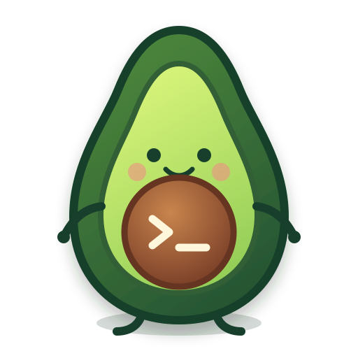

<div align="center">



<h1>Guac Build (<code>guac</code>)</h1>

**Guac Build** is a Muse Spark 1.1-powered terminal coding agent. It runs as a
full-screen TUI that understands your codebase, edits files, executes shell
commands, searches the web, and manages long-running tasks — interactively,
headlessly for scripting/CI, or embedded in editors via the Agent Client
Protocol (ACP).

[Quick start](#quick-start) ·
[Documentation](#documentation) ·
[Repository layout](#repository-layout) ·
[Development](#development) ·
[Contributing](#contributing) ·
[License](#license)

[](https://github.com/h1ddenpr0cess20/guac-build/actions/workflows/ci.yml)

> [!WARNING]
> **Experimental — not production-ready.** Guac Build started as a random idea.
> The `guac` binary builds and passes an end-to-end smoke test against an
> in-tree mock inference server, but it has **not** been exercised against the
> live Meta Model API. Treat it as a work in progress.

This is an independent fork of
[`xai-org/grok-build`](https://github.com/xai-org/grok-build).

The fork keeps Grok Build's Rust harness and local tools, replaces the default
model/provider with Meta's
[`muse-spark-1.1`](https://ai.developer.meta.com/docs/getting-started/models/), enables
Meta Model API search grounding, and removes xAI's hosted `x_search` from the
default agent.

The original internal crate names are intentionally retained to keep upstream
rebases reviewable. Product-facing behavior, the executable, configuration
home, provider, and default model are Guac Build.

</div>

---

## Quick start

Meta Model API is currently available in public preview for US developers.
Create an API key at [Meta's developer portal](https://ai.developer.meta.com/),
then export it:

```sh
export MODEL_API_KEY="..."
```

Requirements:

- **Rust** — the toolchain is pinned by [`rust-toolchain.toml`](rust-toolchain.toml);
  `rustup` installs it automatically on first build.
- **[DotSlash](https://dotslash-cli.com)** — required so hermetic tools under
  [`bin/`](bin/) (notably [`bin/protoc`](bin/protoc)) can download and run.
  Install it and ensure `dotslash` is on your `PATH` **before** building:

  ```sh
  cargo install dotslash
  # or: prebuilt packages — https://dotslash-cli.com/docs/installation/
  /usr/bin/env dotslash --help   # sanity check
  ```

- **protoc** — proto codegen resolves [`bin/protoc`](bin/protoc) via DotSlash,
  or falls back to a `protoc` on `PATH` / `$PROTOC`.
- macOS and Linux are supported build hosts; Windows builds are best-effort
  and not currently tested from this tree.

```sh
cargo run -p xai-grok-pager-bin
cargo build -p xai-grok-pager-bin --release
./target/release/guac --version
```

The binary is `guac`. Configuration and session data live under `~/.guac` by
default; set `GUAC_HOME` to override that location. `GROK_HOME` remains a
compatibility fallback. See the
[authentication guide](crates/codegen/xai-grok-pager/docs/user-guide/02-authentication.md)
and the [Meta integration notes](docs/META_MODEL_API.md).

### Running against a local model

LM Studio and Ollama work without an API key. Start the server, then point a
model at the built-in provider in `~/.guac/config.toml`:

```toml
[model.local]
model = "google/gemma-4-2b"   # the id the server reports
model_provider = "lmstudio"   # or "ollama"
```

```sh
guac -m local
```

Guac reads the context window the server is actually serving that model at and
scales its compaction and tool-output budgets to fit it. See
[Local Models](crates/codegen/xai-grok-pager/docs/user-guide/11-custom-models.md#local-models).

## Documentation

The user guide ships with the pager crate:
[`crates/codegen/xai-grok-pager/docs/user-guide/`](crates/codegen/xai-grok-pager/docs/user-guide/)
— getting started, keyboard shortcuts, slash commands, configuration, theming,
MCP servers, skills, plugins, hooks, headless mode, sandboxing, and more.

Provider references:

- [Meta Model API overview](https://ai.developer.meta.com/docs/getting-started/overview)
- [Muse Spark 1.1 models reference](https://ai.developer.meta.com/docs/getting-started/models/)
- [Search grounding](https://ai.developer.meta.com/docs/getting-started/cookbook/search-grounding/)

## Repository layout

| Path | Contents |
|------|----------|
| `crates/codegen/xai-grok-pager-bin` | Composition-root package; builds the `guac` binary |
| `crates/codegen/xai-grok-pager` | The TUI: scrollback, prompt, modals, rendering |
| `crates/codegen/xai-grok-shell` | Agent runtime + leader/stdio/headless entry points |
| `crates/codegen/xai-grok-tools` | Tool implementations (terminal, file edit, search, ...) |
| `crates/codegen/xai-grok-workspace` | Host filesystem, VCS, execution, checkpoints |
| `crates/codegen/...` | The rest of the CLI crate closure (config, MCP, markdown, sandbox, ...) |
| `crates/common/`, `crates/build/`, `prod/mc/` | Small shared leaf crates pulled in by the closure |
| `third_party/` | Vendored upstream source (Mermaid diagram stack) — see below |

> [!IMPORTANT]
> The root `Cargo.toml` (workspace members, dependency versions, lints,
> profiles) is **generated** — treat it as read-only. Prefer editing per-crate
> `Cargo.toml` files.

## Development

```sh
cargo check -p <crate>        # always target specific crates; full-workspace builds are slow
cargo test -p xai-grok-config # per-crate tests
cargo clippy -p <crate>       # lint config: clippy.toml at the repo root
cargo fmt --all               # rustfmt.toml at the repo root
```

## Contributing

Issues and pull requests are welcome. The upstream
[`CONTRIBUTING.md`](CONTRIBUTING.md) is retained for provenance; Guac Build's
fork policy supersedes its “external contributions are not accepted” note.

## License

First-party code in this repository is licensed under the **Apache License,
Version 2.0** — see [`LICENSE`](LICENSE).

Third-party and vendored code remains under its original licenses. See:

- [`THIRD-PARTY-NOTICES`](THIRD-PARTY-NOTICES) — crates.io / git dependencies,
  bundled UI themes, and **in-tree source ports** (including openai/codex and
  sst/opencode tool implementations)
- [`crates/codegen/xai-grok-tools/THIRD_PARTY_NOTICES.md`](crates/codegen/xai-grok-tools/THIRD_PARTY_NOTICES.md)
  — crate-local notice for the codex and opencode ports (license texts +
  Apache §4(b) change notice)
- [`third_party/NOTICE`](third_party/NOTICE) — vendored Mermaid-stack index

Guac Build is not affiliated with or endorsed by Meta or xAI. Meta, Muse,
Muse Spark, xAI, and Grok are trademarks of their respective owners.
